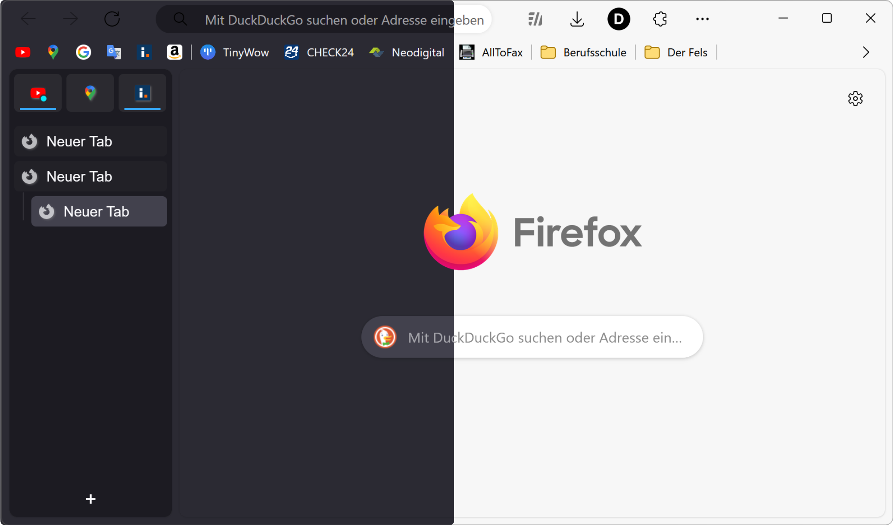

# Edge-Frfox with Sideberry
A Firefox userChrome.css theme that aims to recreate the look and feel of Microsoft Edge mixed with Arc.

BASED ON [EdgyArc-fr](https://github.com/artsyfriedchicken/EdgyArc-fr) and [Edge-Frfox](https://github.com/bmFtZQ/edge-frfox)

<!-- Use  element to set a maximum width. -->

Screenshot: Windows / Firefox 123 / Tweaks: rounded corners, Hide Tabs Toolbar, Disable Drag Space

## How to install
1. Go to `about:support` and click the "Open Folder/Show in Finder" button for the root directory of your browser profile.
2. Download the repository and extract the files.
3. From the repository folder, copy the `chrome` folder and `user.js` file into your Firefox profile folder.
4.  Enable the following settings in `about:config` to enable features in EdgeFrFox
   - `uc.tweak.hide-tabs-bar` to `true`
   - `uc.tweak.rounded-corners` to `true`
   - see optional tweaks under [Tweaks](#tweaks).
5. Install recommended addons: [Sidebery](https://addons.mozilla.org/firefox/addon/sidebery/)
6. Open the Sideberry Settings
7. Import `sidebery-settings.json` and `sidebery-styles.json` into Sidebery
(`Sideberry Settings` > `Help` > `Import Addon Data`)
(If you have your own settings [here](#My-Sideberry-Settings) are the settings I changed)
6. Close and restart Firefox, if performed correctly, the theme should now be installed.
7. Optionally, listed below are some additional Firefox settings that can be changed using `about:config`:

   | Description                                                                                           | Preference Name                                      | Value   |
   | ----------------------------------------------------------------------------------------------------- | ---------------------------------------------------- | ------- |
   | Use Edge-themed context menu on macOS                                                                 | `widget.macos.native-context-menus`                  | `false` |
   | Use light theme in private browsing mode                                                              | `browser.theme.dark-private-windows`                 | `false` |
   | Use rounded bottom window corners on Linux                                                            | `widget.gtk.rounded-bottom-corners.enabled `         | `true`  |
   | Use Windows accent colour in tabs toolbar (must use Windows 'show accent colour in title bar' option) | `browser.theme.windows.accent-color-in-tabs.enabled` | `true`  |

   Additional tweaks can also be applied to the theme such as Floating tabs, Rounded browser corners and more. See [Tweaks](#tweaks).

## Tweaks
Certain tweaks can be applied to the theme, to enable them navigate to `about:config` and create a boolean key for each tweak you want to use and set it to `true`.

To disable a tweak, set the key to `false` or delete it.

---

### Floating/rounded tabs
Emulate the look of the rounded tabs feature available in Edge.

`uc.tweak.floating-tabs`

---

### Rounded browser corners
Add padding and rounded corners around the browser window, as seen in the newest
redesign of Edge.

`uc.tweak.rounded-corners`

---

### Hide tabs toolbar
This hides the tabs toolbar when using a vertical tabs extension such as
Sidebery, Tree Style Tab or Tab Center Reborn.

`uc.tweak.hide-tabs-bar`

---

### Remove extra space at the top of the window
Removes the extra space at the top of the window when not maximised.

`uc.tweak.disable-drag-space`

---

### New tab page background image
Adds a custom background image to the new tab page.

#### Required setup:
* In your `chrome` folder, add an image with a filename of
  `background-0.(jpg/png)`.
* Optionally, add a second image named `background-1.(jpg/png)` this will be
  selected when the dark theme is enabled.

`uc.tweak.newtab-background`

---

### Hide forward button
Hides the forward button when it is not needed, as seen in Edge.

`uc.tweak.hide-forward-button`

---

### Hide Firefox logo on New tab page
Hide the Firefox logo + wordmark when on the new tab page.

`uc.tweak.hide-newtab-logo`

---

### Force tab colour to match the toolbar colour
Removes the ability for custom themes to change the colour of the selected tabs,
instead forcing them to match the toolbar colour. This can be useful when using
themes designed for the Firefox's default Proton style.

 (Left: OFF, Right: ON)

`uc.tweak.force-tab-colour`

---

### Show context menu navigation buttons vertically
Displays the navigation buttons (Back, Forward, Reload, Bookmark) in the
right-click menu vertically like all the other menu items.

`uc.tweak.vertical-context-navigation`

---

### Hide access keys in context menu
Removes the underlining or highlighting of certain characters in the context
menu. These underlines correspond to the key that when pressed, activates the
item.

<!-- Using <ins> for underline as GitHub does not support <u>. -->
For example, "<ins>U</ins>ndo" becomes "Undo" and "Inspect (Q)" becomes
"Inspect".

`uc.tweak.context-menu.hide-access-key`

---

### Remove separators between tabs
Removes the vertical separating lines between the tabs, resulting in a cleaner
look.

`uc.tweak.remove-tab-separators`

---

### Always show tab close buttons when hovering over them
When the tabs become too small, Firefox will hide the close buttons for
non-active tabs to save space. This tweak will always display the close buttons
when hovering over a tab.

`uc.tweak.show-tab-close-button-on-hover`

---

### Use Firefox's default context menu font-size
This reverts the custom font-size set on the context menu, only applies to
Windows users.

`uc.tweak.smaller-context-menu-text`

---

### Disable custom context menu
Disable the custom Edge-themed context menu and use the default Firefox menus.

`uc.tweak.revert-context-menu`

---

### Hide Firefox account from app menu
Hides the Firefox account menu item from the app menu (button with three dots),
the Firefox account menu can still be accessed from the Firefox account button.

`uc.tweak.context-menu.hide-firefox-account`

---

### Compact Extensions Menu
Makes the unified extensions menu more compact, and closer to the design seen in
Edge. This hides the permissions indicator label and makes the icons smaller.

`uc.tweak.context-menu.compact-extensions-menu`

---

## My-Sideberry-Settings

`Navbar`
- `Layout` -> `Hidden`
- `History sub panel` -> `Off`
- `Bookmarks sub panel` -> `Off`
- `Recently closed sub panel` -> `Off`

`Tabs`
- `Position` -> `Bottom`
