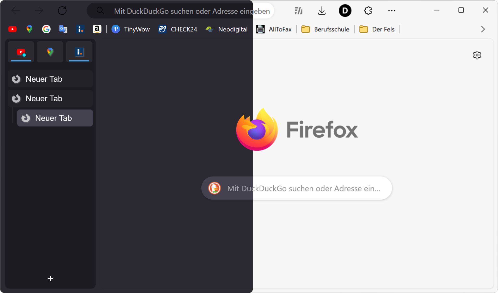

# Edge-Frfox
A Firefox userChrome.css theme that aims to recreate the look and feel of Microsoft Edge.

<!-- Use  element to set a maximum width. -->

Screenshot: macOS / Firefox 120 / Tweaks: rounded corners, hide forward button.

## How to install
1. Go to `about:support` and click the "Open Folder/Show in Finder" button for the root directory of your browser profile.
2. Download the repository and extract the files.
3. From the repository folder, copy the `chrome` folder and `user.js` file into your Firefox profile folder.
4. Close and restart Firefox, if performed correctly, the theme should now be installed.
5. Optionally, listed below are some additional Firefox settings that can be changed using `about:config`:

   | Description                                                                                           | Preference Name                                      | Value   |
   | ----------------------------------------------------------------------------------------------------- | ---------------------------------------------------- | ------- |
   | Use Edge-themed context menu on macOS                                                                 | `widget.macos.native-context-menus`                  | `false` |
   | Use light theme in private browsing mode                                                              | `browser.theme.dark-private-windows`                 | `false` |
   | Use rounded bottom window corners on Linux                                                            | `widget.gtk.rounded-bottom-corners.enabled `         | `true`  |
   | Use Windows accent colour in tabs toolbar (must use Windows 'show accent colour in title bar' option) | `browser.theme.windows.accent-color-in-tabs.enabled` | `true`  |

   Additional tweaks can also be applied to the theme such as Floating tabs, Rounded browser corners and more. See [Tweaks](#tweaks).

**Note: Most frequently tested on macOS**

## Screenshots
| Theme                                        | Light                                    | Dark                                   |
| -------------------------------------------- | ---------------------------------------- | -------------------------------------- |
| Default (Windows 11)                         | ![Light][s-light]                        | ![Dark][s-dark]                        |
| Floating Tabs + Rounded Corners (Windows 11) | ![Light, Floating Tabs][s-light-ft]      | ![Dark, Floating Tabs][s-dark-ft]      |
| Hide Tabs Bar + Rounded Corners (macOS)      | ![Light, Hide Tabs Bar][s-light-mac-htb] | ![Dark, Hide Tabs Bar][s-dark-mac-htb] |
| Rounded Corners (Linux, Ubuntu Yaru theme)   | ![Light, Rounded Corners][s-light-linux] | ![Dark, Rounded Corners][s-dark-linux] |

## Tweaks
Certain tweaks can be applied to the theme, to enable them navigate to `about:config` and create a boolean key for each tweak you want to use and set it to `true`.

To disable a tweak, set the key to `false` or delete it.

---

### Floating/rounded tabs
Emulate the look of the rounded tabs feature available in Edge.

`uc.tweak.floating-tabs`

---

### Rounded browser corners
Add padding and rounded corners around the browser window, as seen in the newest
redesign of Edge.

`uc.tweak.rounded-corners`

---

### Hide tabs toolbar
This hides the tabs toolbar when using a vertical tabs extension such as
Sidebery, Tree Style Tab or Tab Center Reborn.

`uc.tweak.hide-tabs-bar`

---

### Remove extra space at the top of the window
Removes the extra space at the top of the window when not maximised.

`uc.tweak.disable-drag-space`

---

### New tab page background image
Adds a custom background image to the new tab page.

#### Required setup:
* In your `chrome` folder, add an image with a filename of
  `background-0.(jpg/png)`.
* Optionally, add a second image named `background-1.(jpg/png)` this will be
  selected when the dark theme is enabled.

`uc.tweak.newtab-background`

---

### Hide forward button
Hides the forward button when it is not needed, as seen in Edge.

`uc.tweak.hide-forward-button`

---

### Hide Firefox logo on New tab page
Hide the Firefox logo + wordmark when on the new tab page.

`uc.tweak.hide-newtab-logo`

---

### Force tab colour to match the toolbar colour
Removes the ability for custom themes to change the colour of the selected tabs,
instead forcing them to match the toolbar colour. This can be useful when using
themes designed for the Firefox's default Proton style.

 (Left: OFF, Right: ON)

`uc.tweak.force-tab-colour`

---

### Show context menu navigation buttons vertically
Displays the navigation buttons (Back, Forward, Reload, Bookmark) in the
right-click menu vertically like all the other menu items.

`uc.tweak.vertical-context-navigation`

---

### Hide access keys in context menu
Removes the underlining or highlighting of certain characters in the context
menu. These underlines correspond to the key that when pressed, activates the
item.

<!-- Using <ins> for underline as GitHub does not support <u>. -->
For example, "<ins>U</ins>ndo" becomes "Undo" and "Inspect (Q)" becomes
"Inspect".

`uc.tweak.context-menu.hide-access-key`

---

### Remove separators between tabs
Removes the vertical separating lines between the tabs, resulting in a cleaner
look.

`uc.tweak.remove-tab-separators`

---

### Always show tab close buttons when hovering over them
When the tabs become too small, Firefox will hide the close buttons for
non-active tabs to save space. This tweak will always display the close buttons
when hovering over a tab.

`uc.tweak.show-tab-close-button-on-hover`

---

### Use Firefox's default context menu font-size
This reverts the custom font-size set on the context menu, only applies to
Windows users.

`uc.tweak.smaller-context-menu-text`

---

### Disable custom context menu
Disable the custom Edge-themed context menu and use the default Firefox menus.

`uc.tweak.revert-context-menu`

---

### Hide Firefox account from app menu
Hides the Firefox account menu item from the app menu (button with three dots),
the Firefox account menu can still be accessed from the Firefox account button.

`uc.tweak.context-menu.hide-firefox-account`

---

### Compact Extensions Menu
Makes the unified extensions menu more compact, and closer to the design seen in
Edge. This hides the permissions indicator label and makes the icons smaller.

`uc.tweak.context-menu.compact-extensions-menu`

---

## Acknowledgements
[muckSponge](https://github.com/muckSponge) - [MaterialFox](https://github.com/muckSponge/MaterialFox)

[Microsoft](https://github.com/microsoft) - [Fluent UI System Icons](https://github.com/microsoft/fluentui-system-icons)

[KibSquib48](https://github.com/KibSquib48) - [MicaFox](https://github.com/KibSquib48/MicaFox)

<!-- links -->
[1]: https://github.com/lassekongo83/adw-gtk3

<!-- light mode screenshot links -->
[s-light]: screenshots/Windows_default_light.png
[s-light-ft]: screenshots/Windows_floating-tabs_light.png
[s-light-mac-htb]: screenshots/macOS_hide-tabs-bar_light.png
[s-light-linux]: screenshots/Linux_light.png

<!-- dark mode screenshot links -->
[s-dark]: screenshots/Windows_default_dark.png
[s-dark-ft]: screenshots/Windows_floating-tabs_dark.png
[s-dark-mac-htb]: screenshots/macOS_hide-tabs-bar_dark.png
[s-dark-linux]: screenshots/Linux_dark.png

# EdgyArc-fr

Because Arc and Edge look pretty af but FOSS FTW

## Prerequisites

To use EdgyArc-fr to its fullest potential, ensure you have the following prerequisites:

- [EdgeFrFox UserChrome Theme](https://github.com/bmFtZQ/edge-frfox/) 
- [Sidebery](https://addons.mozilla.org/firefox/addon/sidebery/) 
- Recommended Addons:
  - [UserChrome Toggle](https://addons.mozilla.org/firefox/addon/userchrome-toggle/) 
  - [Adaptive Tab Bar Color](https://addons.mozilla.org/en-GB/firefox/addon/adaptive-tab-bar-colour/) - Not supported when translucency is enabled 

## About

EdgyArc-fr is designed to enhance your Firefox user interface by combining the sleekness of Microsoft Edge and the aesthetics of the Arc theme. It incorporates minor tweaks to the EdgeFrFox theme, providing a unique and cohesive visual experience.

## Whats Included

### Minor Tweaks to EdgeFrFox Theme

- Autofades the navigation URL bar when not on hover.
- Makes navigation toolbar buttons and add on buttons grayscale when not hovered.
- MOAR rounded corners, larger padding, and a bit more room to breathe.
- Adjusts sidebar styling to complement Sidebery.
- Optional auto collapsing sidebar.

### UserChrome Toggle Integration

- Easily switch between:
  - Autocollapse sidebar
  - Always expanded sidebar

### Sidebery Configurations

- Included settings and custom CSS for Sidebery
- main styling changes
  - horizontal panel nav bar moved from top to bottom
  - sidebery fades out when not hovered
  - simplified layout for when sidebar is collapsed
    - tabs only show favicons
    - compact pinned tabs layout
    - only active panel icon displayed in panel navigation bar
    - new tab button hidden because it cant be acted upon without expanding sidebar
  

## Usage

1. Install the [EdgeFrFox UserChrome Theme](https://github.com/bmFtZQ/edge-frfox/).
2. Install recommended addons: [Sidebery](https://addons.mozilla.org/firefox/addon/sidebery/), [UserChrome Toggle](https://addons.mozilla.org/firefox/addon/userchrome-toggle/), [Adaptive Tab Bar Colour](https://addons.mozilla.org/en-GB/firefox/addon/adaptive-tab-bar-colour/).
3. Clone or download the EdgyArc-fr repository to your local machine.
4. Copy the contents of the `chrome` folder into your Firefox profile's `chrome` folder.
5. Enable the following settings in `about:config` to enable features in EdgeFrFox
   - `uc.tweak.hide-tabs-bar` to `true`
   - `uc.tweak.disable-drag-space` to `true`
   - `uc.tweak.hide-forward-button` to `true`
   - `uc.tweak.rounded-corners` to `true` 
6. [Optional] Turn on translucent windows by setting `uc.tweak.translucent-window` to `true`
7. Import `sidebery-settings.json` and `sidebery-styles.json` into Sidebery (`Sideberry Settings` > `Help` > `Import Addon Data`)

### Optimum settings for Adaptive Tab Bar Color

## Screenshots

## Changelog
- v1.0.0-b3
  - restyled horizontal navigation bar to make it look less crappy
  - coloured tabs only show colour behind favicon, and not the whole row
  - expand tab group icon now more visible
- v1.0.0-b2
  - added translucency support on macos
  - changed hover opacities and transitions on navigator-toolbox
  - fixed search bar placement in sidebery css
  - fixed 1px bug in sidebery css
- v1.0.0-b1
- initial release

## Issues and Contributions

If you encounter any issues or have suggestions for improvement, please [open an issue](https://github.com/artsyfriedchicken/EdgyArc-fr/issues). Contributions are always welcome!

## License

This project is licensed under the [Mozilla Public License 2.0](https://opensource.org/licenses/MPL-2.0).
